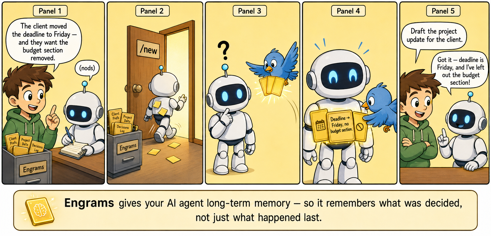

# Engrams



Engrams injects relevant knowledge topics into agent context at session start so the agent applies learned knowledge without being asked.

Engrams does not write or extract topics. Topic creation is manual or handled by a separate dreaming component.

## Why

AI agents forget. They lose knowledge across sessions — behavioral principles, learned patterns, prior decisions — not because the knowledge doesn't exist, but because nothing puts it in context when it matters.

Engrams is the long-term memory layer. Plain markdown topics, a time-windowed selection algorithm, and platform-level injection that the agent can't ignore. No vector database, no embeddings — just the right knowledge at the right time.

Pairs with [ThreadMark](https://github.com/FuzzyTG/Threadmark) for short-term session continuity.

### Engrams vs ThreadMark

| | ThreadMark | Engrams |
|---|---|---|
| Question it answers | "Where was I?" | "What should I know?" |
| Memory type | Short-term | Long-term |
| Scope | Last few exchanges | Accumulated knowledge |
| Ownership | Per-agent, isolated | Cross-agent, shared |
| Lifespan | 24 hours | Durable (evergreen or time-windowed) |
| Trigger | Vague follow-ups ("continue", "do it again") | Every message (active matching) |

## How it works

- Managed hook id: `engrams`
- Plugin id: `engrams`
- Reads `engrams.json` index at `agent:bootstrap`
- Selects top 3 topics based on time window, weight, and agent relevance
- Injects `ENGRAMS_CONTEXT.md` during OpenClaw `agent:bootstrap`

## Topic format

Topics are plain markdown files with YAML frontmatter:

```markdown
---
title: API responses use snake_case
created: 2026-03-15
origin: backend
last_seen: 2026-05-10
weight: 3
participants: [backend, frontend]
evergreen: true
---

All API responses use snake_case field names, not camelCase.
Frontend transforms to camelCase at the boundary.
[[docs/api-style-guide.md]]
```

## Selection algorithm

1. Filter by time window (configurable, default 84 hours). Evergreen topics bypass this filter.
2. Exclude topics where the current agent is neither origin nor participant.
3. Rank: tier 1 (origin match) first, then tier 2 (participant match). Within each tier, sort by weight.
4. Inject top 3.

## Install

Download the latest release tarball from the [Releases page](../../releases).

```sh
tar -xzf engrams-openclaw-v*.tar.gz
cd engrams-openclaw-v*/
./install.sh --dry-run   # preview what will be changed
./install.sh --yes       # install hooks and plugin
```

> **For AI agents:** Run `./install.sh --yes` for fresh installs, or `./install.sh --upgrade --yes` to upgrade an existing installation. Do NOT read the script and run individual `openclaw` commands manually — the install order matters and partial runs corrupt the gateway config.

Restart the OpenClaw gateway after install. Verify:

```sh
openclaw hooks list      # should show engrams
openclaw plugins list    # should show engrams loaded
```

To upgrade an existing installation:

```sh
./install.sh --upgrade --dry-run   # preview
./install.sh --upgrade --yes       # uninstall existing, then clean install
```

To uninstall:

```sh
./uninstall.sh --dry-run   # preview
./uninstall.sh --yes       # remove hooks, plugin, and extension files
```

Restart the OpenClaw gateway after uninstall.

## Rebuilding the index

After creating or editing topic files, rebuild the index:

```sh
npx engrams rebuild
```

This scans all `.md` files in the Engrams directory and regenerates `engrams.json`.

## Development

Requires Node.js ≥ 22.12.0.

```sh
git clone <repo>
cd engrams
npm install
npm run check            # build + test
```

Release artifacts are built automatically by CI on tag push (`git tag v0.1.0 && git push --tags`).
